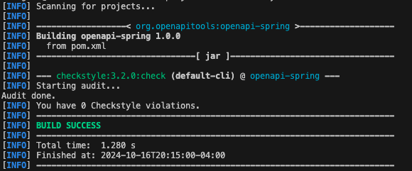
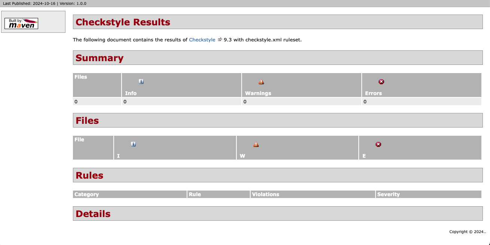
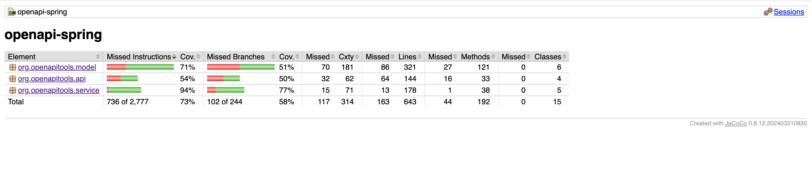
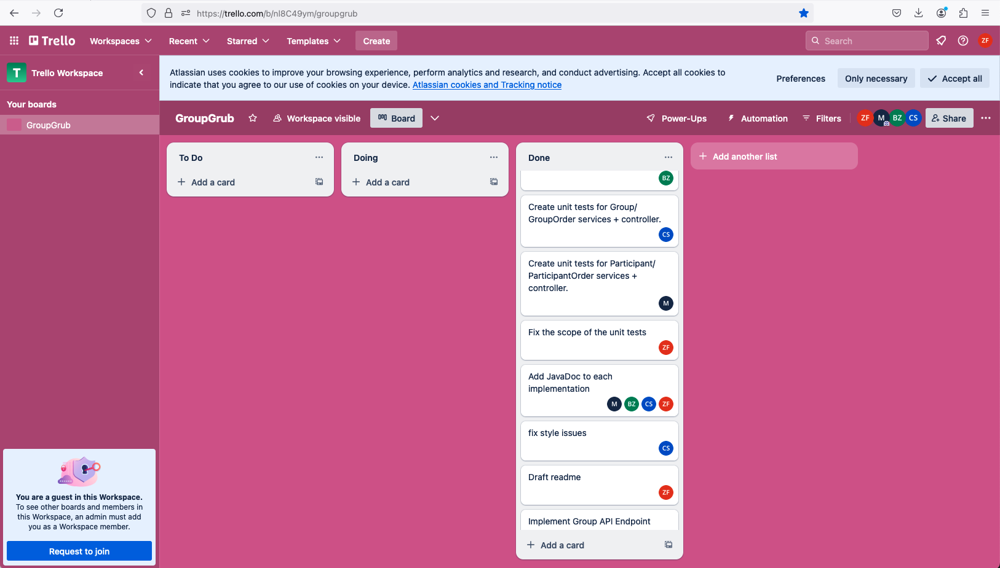

# COMSW4156 Project - GroupGrub

This is the GitHub repository for the service portion of the Project associated with COMS 4156 Advanced Software Engineering. Our team ByteBuilders (Name: Zhengwen Fu, UNI: zf2314 | Name: Marian Abuhazi, UNI: ma4107 | Name: Beijia Zhang, UNI: bz2527 | Name: Chunyu Sui, UNI: cs4480) contributed to all the requirements individually.

## Viewing the Service Repository
Please use the following link to view the repository relevant to the service: https://github.com/capsfly556/ase-4156project

## Building and Running a Local Instance
In order to build and use this service you must install the following (This guide assumes Mac but the Maven README has instructions for both Windows and Mac):

1. Maven 3.9.9: https://maven.apache.org/download.cgi Download and follow the installation instructions, be sure to set the bin as described in Maven's README as a new path variable by editing the system variables if you are on windows or by following the instructions for MacOS.
2. OpenJDK 22: This project used OpenJDK 22 for development so that is what We recommend you use: https://formulae.brew.sh/formula/openjdk
3. IntelliJ IDE: We recommend using IntelliJ but you are free to use any other IDE that you are comfortable with: https://www.jetbrains.com/idea/download/?section=mac
4. When you open IntelliJ you have the option to clone from a GitHub repo, click the green code button and copy the http line that is provided there and give it to your IDE to clone.
5. To set up the database credentials (which is mandatory for running this project), if you are running it in terminal, source a script of this format:
```
#!/bin/bash

export GROUPGRUB_DB_URL=jdbc:mysql://{$YOUR_DB_IP}:3306/{$YOUR_DB_NAME}
export GROUPGRUB_DB_USER={$YOUR_DB_USER}
export GROUPGRUB_DB_PASSWORD={$YOUR_DB_PASSWORD}
```
Also, add these environment variables in IntelliJ run configuration.
6. `cd` to the repository folder in Terminal. In order to set up the project with maven you can run <code>mvn clean install</code> and then you can either run the tests via the test files described below or the main application by running <code>GroupgrubserviceApplication.java</code> from your IDE. You can use <code>mvn clean package</code> to package the project too.
7. If you wish to run the style checker you can with <code>mvn checkstyle:check</code> or <code>mvn checkstyle:checkstyle</code> if you wish to generate the report.

## Running Tests
The unit tests are located under the directory <code>src/test</code>. To run the project's tests in IntelliJ using Java 22, you must first build the project.

From there, you can right-click any of the classes present in the src/test directory and click run to see the results.

## mvn checkstyle:check
You can run the command mvn checkstyle:check > checkstyle-output.txt to verify if the repository adheres to Google's Java style guide. In this case, the check passed successfully with no violations or warnings.


## Endpoints
This section describes the endpoints that the service provides, as well as their inputs and outputs.

### Participants

#### GET /participants
* **Expected Input Parameters:** N/A
* **Expected Output:** A JSON array containing all participants.
* **Description:** Retrieves all participants registered in the service.
* **Upon Success:** HTTP 200 Status Code is returned along with the participants list in the response body.
* **Upon Failure:** 
  * HTTP 404 Status Code with "No participants found" in the response body.

#### POST /participants
* **Expected Input Parameters:** A JSON object containing participant details.
* **Expected Output:** A JSON object containing the added participant's details.
* **Description:** Adds a new participant.
* **Upon Success:** HTTP 201 Status Code is returned along with the participant details in the response body.
* **Upon Failure:** 
  * HTTP 400 Status Code with "Failed to add participant" in the response body.

#### GET /participants/{participantID}
* **Expected Input Parameters:** participantID (String)
* **Expected Output:** A JSON object containing the details of the specified participant.
* **Description:** Retrieves details of a participant by participantID.
* **Upon Success:** HTTP 200 Status Code is returned along with the participant details in the response body.
* **Upon Failure:** 
  * HTTP 404 Status Code with "Participant not found" in the response body.

#### PUT /participants/{participantID}
* **Expected Input Parameters:** participantID (String), A JSON object containing participant details.
* **Expected Output:** A JSON object containing the updated participant's details.
* **Description:** Updates a participant's details.
* **Upon Success:** HTTP 200 Status Code is returned along with the updated participant details in the response body.
* **Upon Failure:** 
  * HTTP 400 Status Code with "Failed to update participant" in the response body.
  * HTTP 404 Status Code with "Participant not found" in the response body.

#### DELETE /participants/{participantID}
* **Expected Input Parameters:** participantID (String)
* **Expected Output:** N/A
* **Description:** Deletes a participant.
* **Upon Success:** HTTP 204 Status Code is returned.
* **Upon Failure:** 
  * HTTP 404 Status Code with "Participant not found" in the response body.

#### GET /participants/{participantID}/orders
* **Expected Input Parameters:** participantID (String)
* **Expected Output:** A JSON array containing all orders for the specified participant.
* **Description:** Retrieves all participant orders for a specific participant.
* **Upon Success:** HTTP 200 Status Code is returned along with the participant orders in the response body.
* **Upon Failure:** 
  * HTTP 404 Status Code with "No participant orders found" in the response body.

#### POST /participants/{participantID}/orders
* **Expected Input Parameters:** participantID (String), A JSON object containing participant order details.
* **Expected Output:** A JSON object containing the added participant's order details.
* **Description:** Creates a new participant order.
* **Upon Success:** HTTP 201 Status Code is returned along with the participant order details in the response body.
* **Upon Failure:** 
  * HTTP 400 Status Code with "Failed to create a new order" in the response body.

#### GET /participants/{participantID}/orders/{participantOrderID}
* **Expected Input Parameters:** participantID (String), participantOrderID (String)
* **Expected Output:** A JSON object containing the details of the specified participant's order.
* **Description:** Retrieves a specific participant's order.
* **Upon Success:** HTTP 200 Status Code is returned along with the participant order details in the response body.
* **Upon Failure:** 
  * HTTP 404 Status Code with "Order not found" in the response body.

#### PUT /participants/{participantID}/orders/{participantOrderID}
* **Expected Input Parameters:** participantID (String), participantOrderID (String), A JSON object containing participant order details.
* **Expected Output:** A JSON object containing the updated participant's order details.
* **Description:** Updates a participant's order.
* **Upon Success:** HTTP 200 Status Code is returned along with the updated participant order details in the response body.
* **Upon Failure:** 
  * HTTP 400 Status Code with "Failed to update order" in the response body.
  * HTTP 404 Status Code with "Order not found" in the response body.

#### DELETE /participants/{participantID}/orders/{participantOrderID}
* **Expected Input Parameters:** participantID (String), participantOrderID (String)
* **Expected Output:** N/A
* **Description:** Deletes a participant's order.
* **Upon Success:** HTTP 204 Status Code is returned.
* **Upon Failure:** 
  * HTTP 404 Status Code with "Order not found" in the response body.

### Groups

#### GET /groups/getAllGroups
* **Expected Input Parameters:** N/A
* **Expected Output:** A JSON array containing all groups.
* **Description:** Retrieves a list of all groups in the service.
* **Upon Success:** HTTP 200 Status Code is returned along with the groups list in the response body.
* **Upon Failure:** 
  * HTTP 404 Status Code with "No groups found" in the response body.

#### POST /groups
* **Expected Input Parameters:** A JSON object containing group details.
* **Expected Output:** A JSON object containing the added group's details.
* **Description:** Adds a new group to the service.
* **Upon Success:** HTTP 201 Status Code is returned along with the group details in the response body.
* **Upon Failure:** 
  * HTTP 400 Status Code with "Failed to add a new group" in the response body.

#### GET /groups/{groupId}
* **Expected Input Parameters:** groupId (String)
* **Expected Output:** A JSON object containing the details of the specified group.
* **Description:** Retrieves details of a specific group.
* **Upon Success:** HTTP 200 Status Code is returned along with the group details in the response body.
* **Upon Failure:** 
  * HTTP 404 Status Code with "Group not found" in the response body.

#### PUT /groups/{groupId}
* **Expected Input Parameters:** groupId (String), A JSON object containing group details.
* **Expected Output:** A JSON object containing the updated group's details.
* **Description:** Updates a group's details.
* **Upon Success:** HTTP 200 Status Code is returned along with the updated group details in the response body.
* **Upon Failure:** 
  * HTTP 404 Status Code with "Group not found" in the response body.

#### DELETE /groups/{groupId}
* **Expected Input Parameters:** groupId (String)
* **Expected Output:** N/A
* **Description:** Deletes a group.
* **Upon Success:** HTTP 204 Status Code is returned.
* **Upon Failure:** 
  * HTTP 404 Status Code with "Group not found" in the response body.

#### GET /groups/{groupId}/orders
* **Expected Input Parameters:** groupId (String)
* **Expected Output:** A JSON array containing all orders for the specified group.
* **Description:** Retrieves all group orders for a specific group.
* **Upon Success:** HTTP 200 Status Code is returned along with the group orders in the response body.

#### POST /groups/{groupId}/orders
* **Expected Input Parameters:** groupId (String), A JSON object containing group order details.
* **Expected Output:** A JSON object containing the added group's order details.
* **Description:** Creates a new group order.
* **Upon Success:** HTTP 201 Status Code is returned along with the group order details in the response body.

#### GET /groups/{groupId}/orders/{orderId}
* **Expected Input Parameters:** groupId (String), orderId (String)
* **Expected Output:** A JSON object containing the details of the specified group order.
* **Description:** Retrieves details of a specific group order.
* **Upon Success:** HTTP 200 Status Code is returned along with the group order details in the response body.
* **Upon Failure:** 
  * HTTP 404 Status Code with "Group order not found" in the response body.

#### PUT /groups/{groupId}/orders/{orderId}
* **Expected Input Parameters:** groupId (String), orderId (String), A JSON object containing group order details.
* **Expected Output:** A JSON object containing the updated group order's details.
* **Description:** Updates a group order.
* **Upon Success:** HTTP 200 Status Code is returned along with the updated group order details in the response body.
* **Upon Failure:** 
  * HTTP 400 Status Code with "Failed to update the group order" in the response body.

#### DELETE /groups/{groupId}/orders/{orderId}
* **Expected Input Parameters:** groupId (String), orderId (String)
* **Expected Output:** N/A
* **Description:** Deletes a group order.
* **Upon Success:** HTTP 204 Status Code is returned.
* **Upon Failure:** 
  * HTTP 404 Status Code with "Group order not found" in the response body.

### Food Providers

#### GET /foodproviders
* **Expected Input Parameters:** N/A
* **Expected Output:** A JSON array containing all food providers.
* **Description:** Retrieves a list of all food providers.
* **Upon Success:** HTTP 200 Status Code is returned along with the food providers list in the response body.
* **Upon Failure:** 
  * HTTP 404 Status Code with "No food providers found" in the response body.

#### POST /foodproviders
* **Expected Input Parameters:** A JSON object containing food provider details.
* **Expected Output:** A JSON object containing the added food provider's details.
* **Description:** Adds a new food provider to the service.
* **Upon Success:** HTTP 201 Status Code is returned along with the food provider details in the response body.
* **Upon Failure:** 
  * HTTP 400 Status Code with "Failed to add food provider" in the response body.

#### GET /foodproviders/{foodProviderId}
* **Expected Input Parameters:** foodProviderId (String)
* **Expected Output:** A JSON object containing the details of the specified food provider.
* **Description:** Retrieves details of a specific food provider.
* **Upon Success:** HTTP 200 Status Code is returned along with the food provider details in the response body.
* **Upon Failure:** 
  * HTTP 404 Status Code with "Food provider not found" in the response body.

#### PUT /foodproviders/{foodProviderId}
* **Expected Input Parameters:** foodProviderId (String), A JSON object containing food provider details.
* **Expected Output:** A JSON object containing the updated food provider's details.
* **Description:** Updates a food provider's details.
* **Upon Success:** HTTP 200 Status Code is returned along with the updated food provider details in the response body.
* **Upon Failure:** 
  * HTTP 400 Status Code with "Failed to update food provider" in the response body.
  * HTTP 404 Status Code with "Food provider not found" in the response body.

#### DELETE /foodproviders/{foodProviderId}
* **Expected Input Parameters:** foodProviderId (String)
* **Expected Output:** N/A
* **Description:** Deletes a food provider.
* **Upon Success:** HTTP 204 Status Code is returned.
* **Upon Failure:** 
  * HTTP 404 Status Code with "Food provider not found" in the response body.

## Style Checking Report
We used the tool "checkstyle" to check the style of the code and generate style checking reports. Here is the report as of the day of 2024/10/16 (these can be found in the images folder):




## Branch Coverage Reporting
We used JaCoCo to perform branch analysis in order to see the branch coverage of the relevant code within the code base. See below for screenshots demonstrating output.



## Project management
We used the tool Trello for the project management. Here is the screenshot of the board as of the day of ???:



## Third-party code
The initial project skeleton is generated using [openapi-generator](https://github.com/OpenAPITools/openapi-generator) with the OpenAPI specs wrote by our team. Specifically, <code>in src/main/java/org/openapitools</code>, the <code>api/\*Api.\*</code> files, the <code>api/ApiUtil.java</code> file, the <code>configuration/\*</code> files, the <code>GroupgrubserviceApplication.java</code> file, and the <code>RFC3339DateFormat.java</code> file are auto-generated and are excluded from the test report.

## Tools used
This section includes notes on tools and technologies used in building this project, as well as any additional details if applicable.

* Maven Package Manager
* Checkstyle
  * We use Checkstyle for code reporting. Note that Checkstyle does NOT get run as part of the CI pipeline.
  * For running Checkstyle manually, you can use the "Checkstyle-IDEA" plugin for IntelliJ.
* JUnit
  * JUnit tests get run automatically as part of the CI pipeline.
* JaCoCo
  * We use JaCoCo for generating code coverage reports.
* openapi-generator
  * We use openapi-generator for the initial project skeleton.
* Trello
  * We use Trello for the project management.
